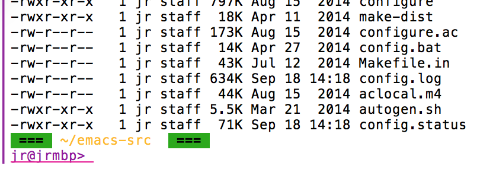
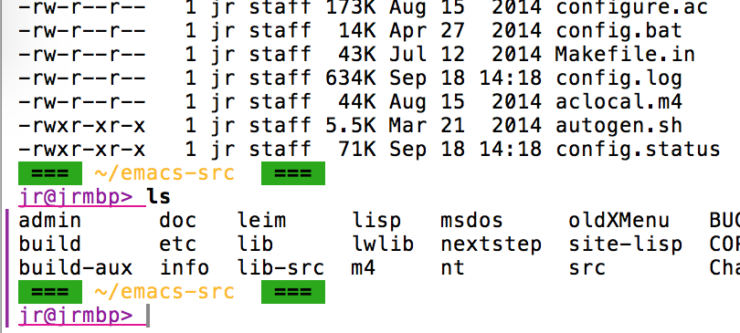

# hl-last-output

A minor mode to highlight the output of the last command in Emacs shell
buffers. Supports both comint derived modes and eshell.

The colored bar on the left side indicates the output of the last command run in
the comint buffer.

As soon as another command is started the highlighting for the previous command
disappears and the new command's output will be highlighted. For long running
commands the bar will get updated on-the-fly.

By Jan Rehders, <jan@sheijk.net>

